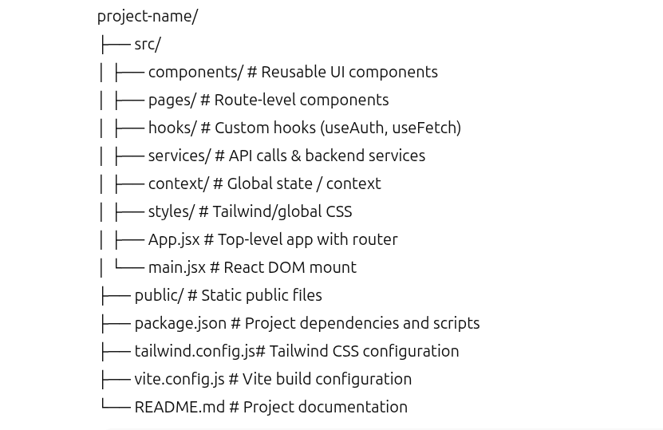

# 🏢 Software Engineer Internship (6-Month Industry-Ready)  

**Mentor:** ChatGPT – Senior Software Engineer  
**Intern:** Shahidul  

---

## 🎯 Internship Goal
After 6 months, you will be able to:

- Build **fullstack, production-ready apps** using React, Node.js, and modern libraries.  
- Work like an **industry software engineer** with feature branches, PRs, testing, and CI/CD.  
- Solve **real-world problems** and collaborate in a professional workflow.  
- Deploy apps live and maintain code quality, documentation, and testing.  

---

## 🗓️ 6-Month Roadmap – Project-Based Learning

| Month | Project | Skills | Deliverables |
|-------|---------|--------|-------------|
| 1 | Starter React App | React basics, components, state, props, forms, Git | Portfolio page or ToDo list (single-page) |
| 2 | Multi-Page React App | Routing, reusable components, responsive UI, Tailwind CSS | Dashboard (Home, About, Contact) |
| 3 | API & CRUD | REST API calls, Axios/fetch, async/await, form validation | Task Manager CRUD app (frontend connected to mock/public API) |
| 4 | Advanced State Project | Context API / Redux Toolkit / Zustand, performance optimization | Dashboard with global state & dynamic data |
| 5 | Fullstack Integration | Node.js/Express backend, MongoDB/Supabase, JWT auth | Fullstack Notes/Task Manager app with auth |
| 6 | Capstone Production Project | Deployment, CI/CD, unit & integration testing, professional documentation | Fullstack app ready for production with live URL, tests, docs, final demo |

**✅ Total Projects:** 6, increasing in complexity from beginner → fullstack → production-ready.

---

## 🛠️ Tools & Libraries

- **Frontend:** React 18+, Vite, Tailwind CSS, React Router DOM v6, React Hook Form, Axios  
- **State Management:** Context API (beginner) / Redux Toolkit / Zustand  
- **Backend:** Node.js, Express, MongoDB/Supabase, JWT auth  
- **Version Control:** Git + GitHub, feature branches, pull requests  
- **Testing:** Vitest, React Testing Library  
- **Deployment:** Vercel / Render / Netlify, GitHub Actions (CI/CD)  
- **Editor:** VSCode with Prettier + ESLint  
- **Documentation:** Markdown, Notion, GitHub Wiki  

---

## 📁 Recommended Project Structure

---

## 🚀 Workflow (Industry Practices)

1. **Daily Routine**
   - Morning: Review tasks + plan coding
   - Afternoon: Implement features, write code
   - Evening: Commit & push changes
2. **Git Workflow**
   - `main` branch = production-ready
   - `feature/<name>` branches = new features
   - PRs for review: concise, descriptive commits
3. **Testing & Linting**
   - Run unit tests before PR
   - Prettier + ESLint for code style
4. **Agile-style Planning**
   - Work in weekly sprints
   - Keep backlog of tasks
   - Reflect weekly on challenges & learning

---

## 📘 Learning & Reference

**Google Search / Docs Examples**
- `"React useState vs useReducer example"`
- `"React Router v6 nested routes example"`
- `"React Hook Form validation example"`
- `"Axios CRUD request React"`
- `"Tailwind CSS responsive layout"`
- `"Node.js Express CRUD API MongoDB tutorial"`
- `"JWT authentication Node.js React"`

**Additional Reading**
- [React Docs](https://reactjs.org/docs/getting-started.html)  
- [MDN Web Docs (JS/HTML/CSS)](https://developer.mozilla.org/)  
- [Node.js Docs](https://nodejs.org/en/docs/)  
- [Tailwind CSS Docs](https://tailwindcss.com/docs/installation)  
- [Redux Toolkit Docs](https://redux-toolkit.js.org/)  

---

## 📈 Weekly Reflection Template
